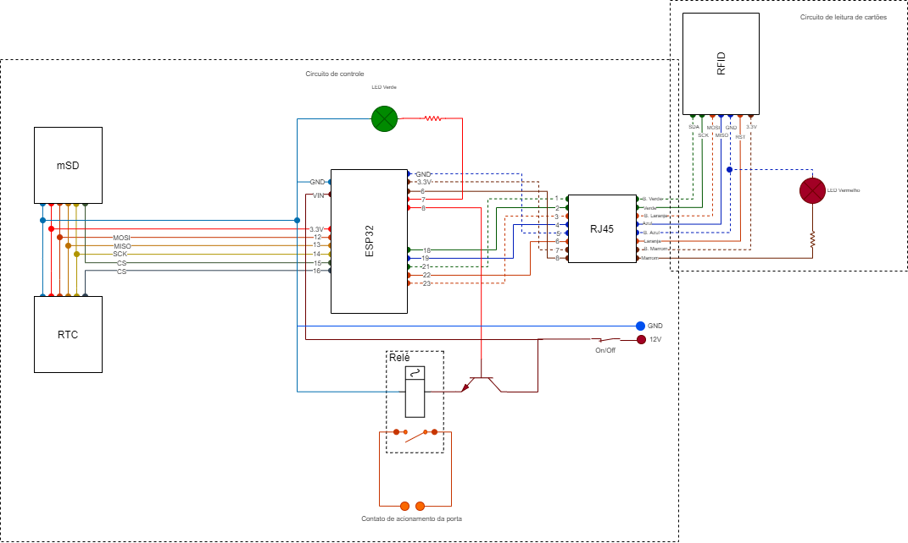

# Controle de acesso CPTM

Controle de acesso feito com Esp32 e módulo MFRC32 para leitura de cartão RFID.

# Mapeamento de portas

## Mapeamento do RFID

| PORTA | FUNÇÃO | COR DO CABO |
| :---- | :----- | :---------- |
| GND   | GND    |
| 3.3V  | 3.3v   |
| 22    | RESET  |
| 21    | SDA    |
| 23    | MOSI   |
| 19    | MISO   |
| 18    | SCK    |
| --    | NC     |

## MAPEAMENTO mSD

| PORTA | FUNÇÃO | COR DO CABO |
| :---- | :----- | :---------- |
| GND   | GND    |
| 3.3V  | 3.3v   |
| 15    | CS     |
| 12    | MOSI   |
| 13    | MISO   |
| 14    | SCK    |

## MAPEAMENTO RTC

| PORTA | FUNÇÃO | COR DO CABO |
| :---- | :----- | :---------- |
| GND   | GND    |
| 3.3V  | 3.3v   |
| 16    | CS     |
| 12    | MOSI   |
| 13    | MISO   |
| 14    | SCK    |

## Mapeamento dos LEDS/RELÉ

| PORTA | FUNÇÃO       | COR DO CABO |
| :---- | :----------- | :---------- |
| 6     | LED VERMELHO |
| 7     | LED VERDE    |
| 8     | RELÉ PORTA   |

# LISTAGEM DE COMPONENTES

- ESP32
- Módulo RFID - RC522 (3.3V)
- Módulo RTC Externo (3.3V)
- Módulo microSD (3.3V)
- Fonte 5V 2A
- Conector Jack P4 fêmea (DC-005)
- Chave Liga/Desliga (10A)
- Led Alto Brilho Vermelho (5mm)
- Led Alto Brilho Verde (5mm)
- Base (soquete) para LED 5mm (x2)
- Conector RJ45 Fêmea
- Relé 5V/300V
- Transistor (BC337)
- Borne 2edgk (x2)
- Borne 2edgrc (x2)
- Caixa para circuito 85mm x 124mm x 53mm (x2)
- 5m de cabo de rede
- Placa de fenolite 20cm x 20cm
- Cabos colorido 0.14mm 2m
- Conector KK 7 vias
- Conector KK 8 vias
- Conector KK 2 vias (x3)

# Diagrama do circuito

